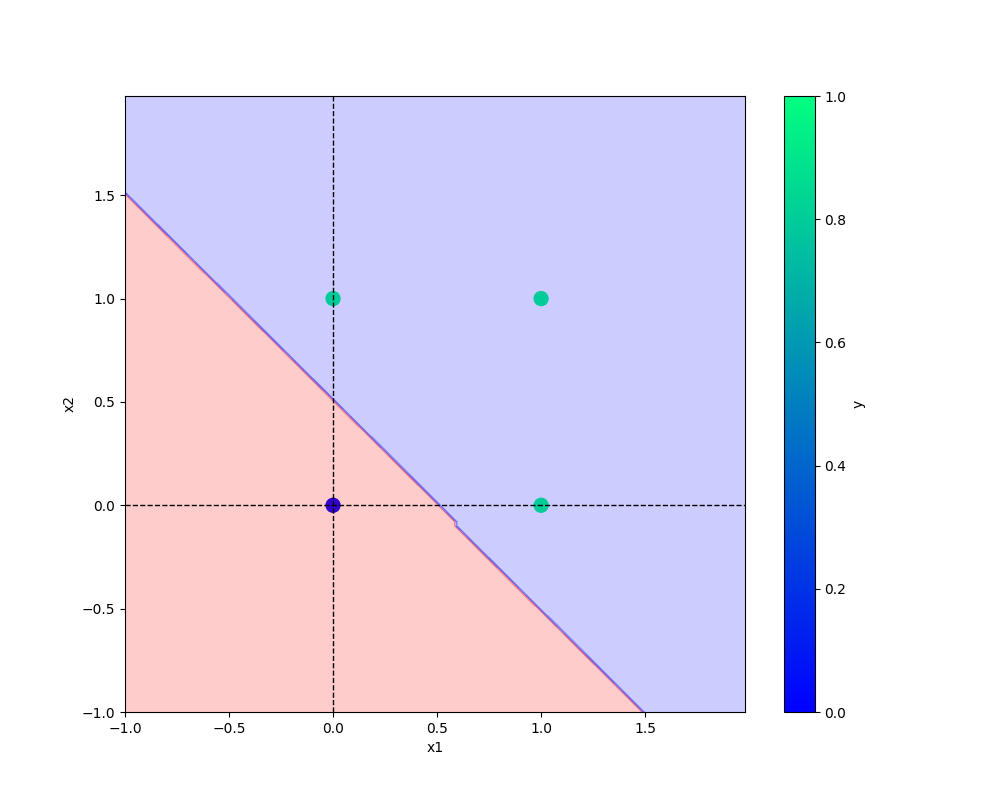

# Perceptron

### Important Points
* The perceptron(or single-layer perceptron) is the simplest model of a neuron that illustrates how a neural network works.
* It is an algorithm for supervised learning of binary classifiers.
* Drawback: It can only work with linearly seperable data points.


### commands used

```bash
git add . && git commit -m "Message" && git push origin main
```

```bash
cp Research\ notebook/demo.ipynb
```

```bash
git config --global user.name "Parul Sharma"
git config --global user.email "parul3kin@gmail.com"
```

### URLs-
[Git Handbook](https://guides.github.com/introduction/git-handbook/)

### Images-



### Adding Python code
```python
print("Adding Python code")
```

### Adding Table 
x1 | x2 | x3 
-|-|-
0|0|0
0|1|0
1|0|0
1|1|1


